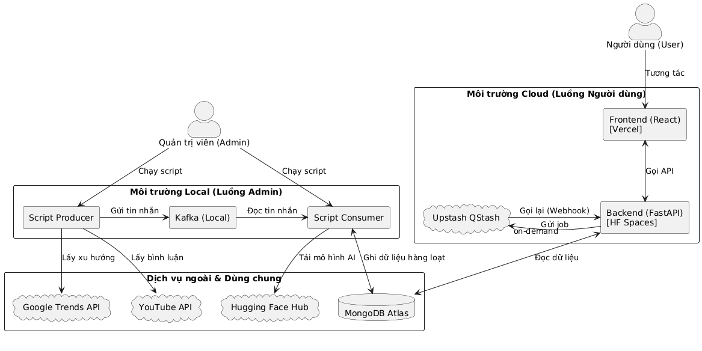

# 📊 Social Sentiment System

> **Intelligent Social Media Sentiment Analysis Platform** - Transforming unstructured social comments into measurable business insights using deep learning and real-time data processing.

[](https://github.com/AlainDeLong2k/Social-Sentiment-System)
[](LICENSE)

---

## 🎯 Overview

Social Sentiment System is a **full-stack sentiment analysis platform** that automatically identifies trending topics from Google Trends, collects related YouTube comments, and applies advanced deep learning models to classify sentiment (Positive, Negative, Neutral) with high accuracy.

The system features a **dual-processing architecture**:

- **Batch Processing**: Apache Kafka for high-throughput local processing
- **On-Demand Processing**: Upstash QStash cloud integration to eliminate timeout issues in background tasks

### Key Highlights

- ✨ **RoBERTa Deep Learning Model** - Accurate multilingual sentiment classification
- ⚡ **Dual-Pipeline Architecture** - Kafka (batch) + QStash (on-demand) processing
- 🚀 **React + FastAPI Stack** - Modern full-stack web application
- 📈 **Weekly Analytics Dashboard** - Real-time visualization of sentiment trends
- 🔍 **Topic Discovery** - Automatic trending topic detection from Google Trends

---

## 🏗️ System Architecture



---

## 🛠️ Technology Stack

### Backend

- **FastAPI** - High-performance Python web framework
- **Apache Kafka** - Distributed event streaming for batch processing
- **Upstash QStash** - Serverless task queue for on-demand processing
- **RoBERTa** - Pre-trained transformer model for sentiment classification
- **PostgreSQL** - Primary data storage

### Frontend

- **React** - Modern UI library with hooks
- **Vite** - Next-generation frontend build tool
- **Bootstrap** - Responsive UI components
- **Chart.js** - Data visualization

### Infrastructure & DevOps

- **Docker** - Containerization
- **Google Trends API** - Topic discovery
- **YouTube API** - Comment collection

---

## 📁 Project Structure

```markdown
Social-Sentiment-System/
├── backend/                    # FastAPI application
│   ├── app/
│   │   ├── api/
│   │   │   └── endpoints/      # REST API endpoints
│   │   ├── core/
│   │   │   ├── clients.py      # External API clients
│   │   │   ├── config.py       # Configuration management
│   │   │   └── db.py           # Database connections
│   │   ├── services/
│   │   │   ├── sentiment_service.py    # RoBERTa inference
│   │   │   └── youtube_service.py      # YouTube API integration
│   │   └── scripts/
│   │       ├── producer_job.py  # Kafka producer
│   │       └── consumer_job.py  # Kafka consumer
│   ├── main.py
│   └── requirements.txt
│
├── frontend/                   # React application
│   ├── src/
│   │   ├── components/         # Reusable UI components
│   │   ├── pages/              # Page components
│   │   ├── services/           # API service layer
│   │   ├── contexts/           # React context (state management)
│   │   └── routes/             # Route configuration
│   ├── vite.config.js
│   └── package.json
│
└── README.md
```

---

## 🚀 Features

### 1. **Automated Topic Discovery**

Identifies trending topics from Google Trends automatically

### 2. **Comment Collection**

Scrapes YouTube comments related to identified trending topics

### 3. **Sentiment Classification**

Uses RoBERTa deep learning model to classify sentiment into 3 categories:

- 😊 **Positive** - Favorable sentiment
- 😐 **Neutral** - Objective or mixed sentiment
- 😞 **Negative** - Unfavorable sentiment

### 4. **Dual-Processing Pipeline**

- **Batch Processing (Kafka)**: For high-volume, scheduled analysis
- **On-Demand Processing (QStash)**: For immediate user requests without timeout concerns

### 5. **Interactive Dashboard**

- Weekly sentiment trend visualization
- Real-time analytics
- Custom topic analysis
- Comprehensive comment browsing

---

## 💡 How It Works

```markdown
1. Google Trends Detection
   ↓
2. YouTube Comment Collection
   ↓
3. Kafka Batch Processing / QStash On-Demand
   ↓
4. RoBERTa Sentiment Classification
   ↓
5. React Dashboard Visualization
```

---

## 📊 Key Innovation: Dual-Processing Architecture

### Problem Solved

Traditional cloud-based processing solutions suffer from:

- ❌ Timeout issues on long-running tasks
- ❌ Cold starts affecting response times
- ❌ High costs for always-on infrastructure

### Solution

**Hybrid Architecture**:

- **Local Kafka**: Handles high-throughput batch processing without constraints
- **Cloud QStash**: Enables on-demand processing with built-in reliability and no timeout limits

This combination ensures both **performance** and **reliability**.

---

## 📧 Contact & Resources

- **Repository**: [GitHub](https://github.com/AlainDeLong2k/Social-Sentiment-System)
- **License**: MIT

---

*Built as a Capstone Project - Combining modern data engineering practices with AI/ML capabilities for real-world sentiment analysis.*
